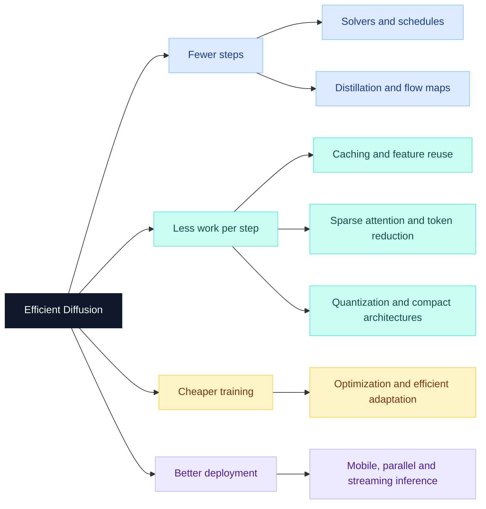

# ⚡ Awesome Efficient Diffusion

**Less compute. More creation.**

A curated collection of papers, benchmarks, surveys, and implementations on **efficient diffusion and flow matching models** for image and video generation. It covers fast sampling, distillation, caching, sparse attention, quantization, compact architectures, efficient training, and deployment.

让扩散模型跑得更快、占得更少。

## Quick Navigation

- [Research Landscape](#research-landscape) · [Representative Works](#representative-works)
- [Benchmarks](#benchmarks) · [Survey Papers](#survey-papers)
- [Papers by Year](#papers-by-year): [2026](#2026) · [2025](#2025) · [2024](#2024) · [2023](#2023) · [2022](#2022)
- [Implementations](#implementations) · [Related Repositories](#related-repositories)
- [Contributing / Scope](#contributing--scope)

## Research Landscape

Methods often combine several mechanisms. The yearly index places each paper under its primary contribution; cross-cutting works such as SVDQuant, QuantCache, and TurboDiffusion connect multiple directions.

| Direction | Main efficiency target | Coverage |
| --- | --- | --- |
| **Sampling and solvers** | Fewer model evaluations | Numerical solvers, schedules, and sampling algorithms |
| **Distillation and few-step generation** | Fewer generation steps | Progressive, consistency, distribution-matching, and flow-map methods |
| **Caching and feature reuse** | Less repeated computation | Step, layer, token, and trajectory reuse |
| **Efficient attention and token reduction** | Cheaper attention | Sparse or low-precision attention and token merging |
| **Quantization and compression** | Lower precision and memory | Weight/activation quantization, binarization, and mixed precision |
| **Efficient architectures and latent spaces** | Smaller per-step workload | Pruning, compact networks, and spatially compressed latents |
| **Efficient training and adaptation** | Lower training cost | Optimization, representation alignment, and parameter-efficient tuning |
| **Systems and deployment** | Faster end-to-end execution | Mobile inference, parallel execution, and streaming deployment |

**Browse by year and direction** — counts link directly to each subsection.

| Year | Sampling | Distillation | Caching | Attention | Quantization | Architecture | Training | Systems |
| --- | ---: | ---: | ---: | ---: | ---: | ---: | ---: | ---: |
| **[2026](#2026)** | — | [7](#2026-distillation) | [10](#2026-caching) | [4](#2026-attention) | [7](#2026-quantization) | [2](#2026-architecture) | — | [2](#2026-systems) |
| **[2025](#2025)** | [2](#2025-sampling) | [10](#2025-distillation) | [8](#2025-caching) | [9](#2025-attention) | [17](#2025-quantization) | [2](#2025-architecture) | [4](#2025-training) | [2](#2025-systems) |
| **[2024](#2024)** | [1](#2024-sampling) | [12](#2024-distillation) | [2](#2024-caching) | [1](#2024-attention) | [12](#2024-quantization) | [1](#2024-architecture) | [3](#2024-training) | [2](#2024-systems) |
| **[2023](#2023)** | [4](#2023-sampling) | [4](#2023-distillation) | — | [1](#2023-attention) | [5](#2023-quantization) | [1](#2023-architecture) | [5](#2023-training) | [1](#2023-systems) |
| **[2022](#2022)** | [5](#2022-sampling) | [1](#2022-distillation) | — | — | — | [1](#2022-architecture) | — | — |

## Representative Works

A reading path across the main efficiency mechanisms. These are starting points, not a ranking.

| Direction | Work | Venue | What to look for |
| --- | --- | --- | --- |
| Sampling | **[DPM-Solver](https://proceedings.neurips.cc/paper_files/paper/2022/hash/260a14acce2a89dad36adc8eefe7c59e-Abstract-Conference.html)** | NeurIPS 2022 | High-order diffusion ODE solvers. |
| Distillation | **[Progressive Distillation](https://arxiv.org/abs/2202.00512)** | ICLR 2022 | Repeatedly halve the teacher sampling trajectory. |
| Distillation | **[Consistency Models](https://proceedings.mlr.press/v202/song23a.html)** | ICML 2023 | Learn direct mappings along denoising trajectories. |
| Distillation | **[DMD2](https://proceedings.neurips.cc/paper_files/paper/2024/hash/54dcf25318f9de5a7a01f0a4125c541e-Abstract-Conference.html)** | NeurIPS 2024 | Distribution matching for fast image synthesis. |
| Flow maps | **[MeanFlow](https://papers.neurips.cc/paper_files/paper/2025/hash/6d13e085b79d454da5910e4ca82a3d9d-Abstract-Conference.html)** | NeurIPS 2025 | Average velocity for one-step generation. |
| Caching | **[DeepCache](https://openaccess.thecvf.com/content/CVPR2024/html/Ma_DeepCache_Accelerating_Diffusion_Models_for_Free_CVPR_2024_paper.html)** | CVPR 2024 | Reuse intermediate features across denoising steps. |
| Video caching | **[TeaCache](https://openaccess.thecvf.com/content/CVPR2025/html/Liu_Timestep_Embedding_Tells_Its_Time_to_Cache_for_Video_Diffusion_CVPR_2025_paper.html)** | CVPR 2025 | Use timestep-dependent signals to schedule reuse. |
| Forecasting | **[TaylorSeer](https://openaccess.thecvf.com/content/ICCV2025/html/Liu_From_Reusing_to_Forecasting_Accelerating_Diffusion_Models_with_TaylorSeers_ICCV_2025_paper.html)** | ICCV 2025 | Forecast features rather than only reusing them. |
| Low-bit models | **[SVDQuant](https://iclr.cc/virtual/2025/poster/27906)** | ICLR 2025 | Combine low-rank outlier handling with 4-bit inference. |
| Video compression | **[QuantSparse](https://proceedings.iclr.cc/paper_files/paper/2026/hash/94359ca6e248af69b8b6854668ae9782-Abstract-Conference.html)** | ICLR 2026 | Combine model quantization and attention sparsification. |
| Sparse attention | **[Sliding Tile Attention](https://proceedings.mlr.press/v267/zhang25m.html)** | ICML 2025 | Align sparse attention with efficient GPU execution. |
| Architecture | **[SANA](https://proceedings.iclr.cc/paper_files/paper/2025/hash/34345e243156da67605d4b63d71c8d98-Abstract-Conference.html)** | ICLR 2025 | Linear attention and compressed latent representations. |
| Training | **[REPA](https://proceedings.iclr.cc/paper_files/paper/2025/hash/d9e42b4d7163931f3689d6d6fbaa11d0-Abstract-Conference.html)** | ICLR 2025 | Use pretrained representations to improve diffusion training. |
| Parallel inference | **[DistriFusion](https://openaccess.thecvf.com/content/CVPR2024/papers/Li_DistriFusion_Distributed_Parallel_Inference_for_High-Resolution_Diffusion_Models_CVPR_2024_paper.pdf)** | CVPR 2024 | Distribute high-resolution generation across GPUs. |
| Streaming video | **[Self Forcing](https://proceedings.neurips.cc/paper_files/paper/2025/hash/f4823f831af67a3ef15e41a85434422a-Abstract-Conference.html)** | NeurIPS 2025 | Train few-step autoregressive video generators on their own histories. |
| Video distillation | **[rCM](https://proceedings.iclr.cc/paper_files/paper/2026/hash/0534abc9e6db91683d82186ef0d68202-Abstract-Conference.html)** | ICLR 2026 | Scale continuous-time consistency distillation to video models. |

## Benchmarks

Evaluate generation quality alongside latency, throughput, peak memory, and model size. Quality benchmarks below are not standardized speed leaderboards: report the model, GPU, precision, resolution, video length, batch size, sampling steps, and guidance configuration for every efficiency comparison.

| Benchmark | Venue | Evaluation focus | Resources |
| --- | --- | --- | --- |
| **GenEval: An Object-Focused Framework for Evaluating Text-to-Image Alignment** | NeurIPS 2023, Datasets and Benchmarks | Objects, counts, colors, positions, and compositional text-image alignment | [Paper](https://proceedings.nips.cc/paper_files/paper/2023/file/a3bf71c7c63f0c3bcb7ff67c67b1e7b1-Paper-Datasets_and_Benchmarks.pdf) |
| **VBench: Comprehensive Benchmark Suite for Video Generative Models** | CVPR 2024 | Multiple dimensions of video generation quality | [Paper](https://openaccess.thecvf.com/content/CVPR2024/html/Huang_VBench_Comprehensive_Benchmark_Suite_for_Video_Generative_Models_CVPR_2024_paper.html) |

## Survey Papers

| Survey | Venue | Focus | Resources |
| --- | --- | --- | --- |
| **Efficient Diffusion Models: A Comprehensive Survey From Principles to Practices** | IEEE TPAMI 2025 | Architectures, training, inference, and deployment | [Paper](https://arxiv.org/abs/2410.11795) · [Published version](https://doi.org/10.1109/TPAMI.2025.3569700) |
| **Efficient Diffusion Models: A Survey** | TMLR 2025 | A systematic review of diffusion efficiency techniques | [Paper](https://openreview.net/pdf?id=wHECkBOwyt) |

## Papers by Year

**Year convention:** use the formal publication year, or the announced conference year for accepted papers; otherwise use the first preprint year. A paper first released in 2024 and published at ICLR 2025 appears once under 2025. `arXiv` and workshop entries are explicitly labeled. The research-paper count excludes the separate benchmarks and surveys.

The selection emphasizes main-track papers at leading conferences and journals. A small number of influential exceptions have linked evidence of early community attention or adoption. The review covers 2022–2026, including verified 2026 conference papers; it is a curated index rather than a claim of exhaustive coverage.

<strong>🔎 Why include these papers outside the main conference/journal selection?</strong>

| Work | Evidence for inclusion |
| --- | --- |
| [Latent Consistency Models](https://arxiv.org/abs/2310.04378) | LCM ecosystem integration documented by Hugging Face in November 2023. [Evidence](https://huggingface.co/blog/lcm_lora) |
| [Fast High-Resolution Image Synthesis with Latent Adversarial Diffusion Distillation](https://arxiv.org/abs/2403.12015) | Hugging Face Daily Papers #1; submitted the day after release. [Evidence](https://huggingface.co/papers/2403.12015) |
| [TurboDiffusion](https://arxiv.org/abs/2512.16093) | Hugging Face Daily Papers #1; submitted within one week of release. [Evidence](https://huggingface.co/papers/2512.16093) |
| [Token Merging for Fast Stable Diffusion](https://openaccess.thecvf.com/content/CVPR2023W/ECV/html/Bolya_Token_Merging_for_Fast_Stable_Diffusion_CVPRW_2023_paper.html) | Release-week Diffusers community benchmarking, March 2023; workshop status is explicit. [Evidence](https://github.com/huggingface/diffusers/issues/2940) |
| [SDXL-Lightning](https://arxiv.org/abs/2402.13929) | Release-week public discussion and experimentation, February 2024. [Evidence](https://www.reddit.com/r/StableDiffusion/comments/1awpbg3) |
| [DPM-Solver++](https://link.springer.com/article/10.1007/s11633-025-1562-4) | Author-maintained history records Apple/Hugging Face Swift integration in December 2022; first preprint 2022. [Evidence](https://github.com/LuChengTHU/dpm-solver#news) |

Attention evidence records public interest or adoption, not a peer-review decision or a scientific quality score.

### 2026

**32 papers** · [Back to navigation](#quick-navigation)

#### Distillation and few-step generation

- **[CVPR] VDOT: Efficient Unified Video Creation via Optimal Transport Distillation** · [Paper](https://openaccess.thecvf.com/content/CVPR2026/html/Wang_VDOT_Efficient_Unified_Video_Creation_via_Optimal_Transport_Distillation_CVPR_2026_paper.html) · [Code](https://github.com/hhhh1138/VDOT)
- **[ECCV (accepted)] AnyFlow: Any-Step Video Diffusion Model with On-Policy Flow Map Distillation** · [Paper](https://arxiv.org/abs/2605.13724)
- **[ICLR] Joint Distillation for Fast Likelihood Evaluation and Sampling in Flow-based Models** · [Paper](https://proceedings.iclr.cc/paper_files/paper/2026/hash/4a8244cd160c6862ff144e14322c32bb-Abstract-Conference.html)
- **[ICLR] Large Scale Diffusion Distillation via Score-Regularized Continuous-Time Consistency** · [Paper](https://proceedings.iclr.cc/paper_files/paper/2026/hash/0534abc9e6db91683d82186ef0d68202-Abstract-Conference.html) · [Code](https://github.com/NVlabs/rcm)
- **[ICLR] Rolling Forcing: Autoregressive Long Video Diffusion in Real Time** · [Paper](https://proceedings.iclr.cc/paper_files/paper/2026/hash/935151cc6cb5d8b6816133b75233775a-Abstract-Conference.html)
- **[ICLR] SenseFlow: Scaling Distribution Matching for Flow-based Text-to-Image Distillation** · [Paper](https://proceedings.iclr.cc/paper_files/paper/2026/hash/94a98f4338b6e5fba81344f961bac8e5-Abstract-Conference.html) · [Code](https://github.com/XingtongGe/SenseFlow)
- **[ICML] Causal Forcing: Autoregressive Diffusion Distillation Done Right for High-Quality Real-Time Interactive Video Generation** · [Paper](https://arxiv.org/abs/2602.02214) · [Code](https://github.com/thu-ml/Causal-Forcing)

#### Caching and feature reuse

- **[CVPR] Accelerating Autoregressive Video Diffusion via History-Guided Cache and Residual Correction** · [Paper](https://openaccess.thecvf.com/content/CVPR2026/html/Nan_Accelerating_Autoregressive_Video_Diffusion_via_History-Guided_Cache_and_Residual_Correction_CVPR_2026_paper.html)
- **[CVPR] D2Cache: Second-Order Delta Caching for Higher Video Diffusion Acceleration** · [Paper](https://openaccess.thecvf.com/content/CVPR2026/html/Liu_D2Cache_Second-Order_Delta_Caching_for_Higher_Video_Diffusion_Acceleration_CVPR_2026_paper.html)
- **[CVPR] DisCa: Accelerating Video Diffusion Transformers with Distillation-Compatible Learnable Feature Caching** · [Paper](https://arxiv.org/abs/2602.05449) · [Code](https://github.com/Tencent-Hunyuan/DisCa)
- **[CVPR] SenCache: Accelerating Diffusion Model Inference via Sensitivity-Aware Caching** · [Paper](https://openaccess.thecvf.com/content/CVPR2026/html/Haghighi_SenCache_Accelerating_Diffusion_Model_Inference_via_Sensitivity-Aware_Caching_CVPR_2026_paper.html)
- **[ECCV (accepted)] ResilPhase: Plug-and-Play Phase Mapping and Noise-Resilient Macro-Trajectory Extrapolation for Diffusion Acceleration** · [Paper](https://arxiv.org/abs/2606.26769)
- **[ICLR] DiCache: Let Diffusion Model Determine Its Own Cache** · [Paper](https://proceedings.iclr.cc/paper_files/paper/2026/hash/78288ef33b18a351c3cd679dc9a15c8d-Abstract-Conference.html)
- **[ICLR] ERTACache: Error Rectification and Timesteps Adjustment for Efficient Diffusion** · [Paper](https://proceedings.iclr.cc/paper_files/paper/2026/hash/84d395725a9b40cb4a49d84478ac24c7-Abstract-Conference.html)
- **[ICLR] Q&C: When Quantization Meets Cache in Efficient Generation** · [Paper](https://proceedings.iclr.cc/paper_files/paper/2026/hash/999fcab97007ebef0cda9949550b4a9e-Abstract-Conference.html)
- **[ICLR] Relational Feature Caching for Accelerating Diffusion Transformers** · [Paper](https://proceedings.iclr.cc/paper_files/paper/2026/hash/4019681ef05e8e347c3067d7f973a364-Abstract-Conference.html)
- **[ICLR] ScalingCache: Extreme Acceleration of DiTs through Difference Scaling and Dynamic Interval Caching** · [Paper](https://proceedings.iclr.cc/paper_files/paper/2026/hash/51373b6499708b6fcc38f1e8f8f5b376-Abstract-Conference.html)

#### Efficient attention and token reduction

- **[AAAI] Sparse-vDiT: Unleashing the Power of Sparse Attention to Accelerate Video Diffusion Transformers** · [Paper](https://ojs.aaai.org/index.php/AAAI/article/view/37287)
- **[CVPR] BinaryAttention: One-Bit QK-Attention for Vision and Diffusion Transformers** · [Paper](https://openaccess.thecvf.com/content/CVPR2026/papers/Xiao_BinaryAttention_One-Bit_QK-Attention_for_Vision_and_Diffusion_Transformers_CVPR_2026_paper.pdf)
- **[ICML] Light Forcing: Accelerating Autoregressive Video Diffusion via Sparse Attention** · [Paper](https://arxiv.org/abs/2602.04789) · [Code](https://github.com/chengtao-lv/LightForcing)
- **[ICML] Veda: Scalable Video Diffusion via Distilled Sparse Attention** · [Paper](https://arxiv.org/abs/2605.30325)

#### Quantization and compression

- **[AAAI] TR-DQ: Time-Rotation Diffusion Quantization** · [Paper](https://ojs.aaai.org/index.php/AAAI/article/view/37841)
- **[CVPR] DeltaQuant: 4-bit Video Diffusion Models with Spatiotemporal Delta Smoothing** · [Paper](https://openaccess.thecvf.com/content/CVPR2026/html/Li_DeltaQuant_4-bit_Video_Diffusion_Models_with_Spatiotemporal_Delta_Smoothing_CVPR_2026_paper.html)
- **[CVPR] SegQuant: A Semantics-Aware and Generalizable Quantization Framework for Diffusion Models** · [Paper](https://arxiv.org/abs/2507.14811) · [Code](https://github.com/OptiSys-ZJU/segquant)
- **[ICLR] Beyond Uniformity: Sample and Frequency Meta Weighting for Post-Training Quantization of Diffusion Models** · [Paper](https://proceedings.iclr.cc/paper_files/paper/2026/hash/58e5f95c8c4789af382ab48b4cbc6d9d-Abstract-Conference.html)
- **[ICLR] DVD-Quant: Data-free Video Diffusion Transformers Quantization** · [Paper](https://proceedings.iclr.cc/paper_files/paper/2026/hash/3bd28dd5cc4e15f9e019da13cc0c4844-Abstract-Conference.html)
- **[ICLR] Gradient-Aligned Calibration for Post-Training Quantization of Diffusion Models** · [Paper](https://proceedings.iclr.cc/paper_files/paper/2026/hash/dd3065a00d9b93e3d4d17faa907100bb-Abstract-Conference.html)
- **[ICLR] QuantSparse: Comprehensively Compressing Video Diffusion Transformer with Model Quantization and Attention Sparsification** · [Paper](https://proceedings.iclr.cc/paper_files/paper/2026/hash/94359ca6e248af69b8b6854668ae9782-Abstract-Conference.html) · [Code](https://github.com/wlfeng0509/QuantSparse)

#### Efficient architectures and latent spaces

- **[ECCV (accepted)] DC-Gen: Post-Training Diffusion Acceleration with Deeply Compressed Latent Space** · [Paper](https://arxiv.org/abs/2509.25180) · [Code](https://github.com/dc-ai-projects/DC-Gen)
- **[ICLR] SANA-Video: Efficient Video Generation with Block Linear Diffusion Transformer** · [Paper](https://proceedings.iclr.cc/paper_files/paper/2026/hash/41b93c59da0d0f835907fd661d419db2-Abstract-Conference.html) · [Code](https://github.com/NVlabs/Sana)

#### Systems and deployment

- **[ICML] Deep Forcing: Training-Free Long Video Generation with Deep Sink and Participative Compression** · [Paper](https://arxiv.org/abs/2512.05081)
- **[ICML] FAST-AR: Fast Autoregressive Video Diffusion and World Models with Temporal Cache Compression and Sparse Attention** · [Paper](https://arxiv.org/abs/2602.01801)

### 2025

**54 papers** · [Back to navigation](#quick-navigation)

#### Sampling and solvers

- **[ICLR] Faster Diffusion Sampling with Randomized Midpoints: Sequential and Parallel** · [Paper](https://proceedings.iclr.cc/paper_files/paper/2025/hash/f30307ac840b88f86f4ab5761b2d6595-Abstract-Conference.html)
- **[Machine Intelligence Research] DPM-Solver++: Fast Solver for Guided Sampling of Diffusion Probabilistic Models** · [Paper](https://link.springer.com/article/10.1007/s11633-025-1562-4) · [Code](https://github.com/LuChengTHU/dpm-solver) · [Early attention](https://github.com/LuChengTHU/dpm-solver#news)

#### Distillation and few-step generation

- **[AAAI] Flash Diffusion: Accelerating Any Conditional Diffusion Model for Few Steps Image Generation** · [Paper](https://ojs.aaai.org/index.php/AAAI/article/view/33722) · [Code](https://github.com/gojasper/flash-diffusion)
- **[CVPR] From Slow Bidirectional to Fast Autoregressive Video Diffusion Models** · [Paper](https://openaccess.thecvf.com/content/CVPR2025/html/Yin_From_Slow_Bidirectional_to_Fast_Autoregressive_Video_Diffusion_Models_CVPR_2025_paper.html)
- **[ICCV] Adversarial Distribution Matching for Diffusion Distillation Towards Efficient Image and Video Synthesis** · [Paper](https://openaccess.thecvf.com/content/ICCV2025/papers/Lu_Adversarial_Distribution_Matching_for_Diffusion_Distillation_Towards_Efficient_Image_and_ICCV_2025_paper.pdf)
- **[ICCV] SANA-Sprint: One-Step Diffusion with Continuous-Time Consistency Distillation** · [Paper](https://openaccess.thecvf.com/content/ICCV2025/html/Chen_SANA-Sprint_One-Step_Diffusion_with_Continuous-Time_Consistency_Distillation_ICCV_2025_paper.html) · [Code](https://github.com/NVlabs/Sana)
- **[ICLR] One Step Diffusion via Shortcut Models** · [Paper](https://proceedings.iclr.cc/paper_files/paper/2025/hash/559a0998fab1d19b80e7e43a5852401c-Abstract-Conference.html) · [Code](https://github.com/kvfrans/shortcut-models)
- **[ICLR] Simple ReFlow: Improved Techniques for Fast Flow Models** · [Paper](https://proceedings.iclr.cc/paper_files/paper/2025/hash/a95ba79ea3881ffd9fb8620e1a0d4b36-Abstract-Conference.html)
- **[ICLR] Simplifying, Stabilizing and Scaling Continuous-Time Consistency Models** · [Paper](https://proceedings.iclr.cc/paper_files/paper/2025/file/7e9c2053258b1bdd32ff2654802cd594-Paper-Conference.pdf)
- **[NeurIPS] Mean Flows for One-step Generative Modeling** · [Paper](https://papers.neurips.cc/paper_files/paper/2025/hash/6d13e085b79d454da5910e4ca82a3d9d-Abstract-Conference.html)
- **[NeurIPS] Self Forcing: Bridging the Train-Test Gap in Autoregressive Video Diffusion** · [Paper](https://proceedings.neurips.cc/paper_files/paper/2025/hash/f4823f831af67a3ef15e41a85434422a-Abstract-Conference.html)
- **[NeurIPS] Shortcutting Pre-trained Flow Matching Diffusion** · [Paper](https://proceedings.neurips.cc/paper_files/paper/2025/file/e0d09183aea768b8eb3a7ae972a3d45c-Paper-Conference.pdf)

#### Caching and feature reuse

- **[CVPR] CacheQuant: Comprehensively Accelerated Diffusion Models** · [Paper](https://openaccess.thecvf.com/content/CVPR2025/html/Liu_CacheQuant_Comprehensively_Accelerated_Diffusion_Models_CVPR_2025_paper.html)
- **[CVPR] Timestep Embedding Tells: It's Time to Cache for Video Diffusion Model** · [Paper](https://openaccess.thecvf.com/content/CVPR2025/html/Liu_Timestep_Embedding_Tells_Its_Time_to_Cache_for_Video_Diffusion_CVPR_2025_paper.html) · [Code](https://github.com/ali-vilab/TeaCache)
- **[ICCV] Adaptive Caching for Faster Video Generation with Diffusion Transformers** · [Paper](https://openaccess.thecvf.com/content/ICCV2025/html/Kahatapitiya_Adaptive_Caching_for_Faster_Video_Generation_with_Diffusion_Transformers_ICCV_2025_paper.html)
- **[ICCV] From Reusing to Forecasting: Accelerating Diffusion Models with TaylorSeers** · [Paper](https://openaccess.thecvf.com/content/ICCV2025/html/Liu_From_Reusing_to_Forecasting_Accelerating_Diffusion_Models_with_TaylorSeers_ICCV_2025_paper.html)
- **[ICCV] QuantCache: Adaptive Importance-Guided Quantization with Hierarchical Latent and Layer Caching for Video Generation** · [Paper](https://openaccess.thecvf.com/content/ICCV2025/html/Wu_QuantCache_Adaptive_Importance-Guided_Quantization_with_Hierarchical_Latent_and_Layer_Caching_ICCV_2025_paper.html)
- **[ICLR] Accelerating Diffusion Transformers with Token-wise Feature Caching** · [Paper](https://proceedings.iclr.cc/paper_files/paper/2025/file/bbe024e0517fe12ac3a8d388b19ff9fe-Paper-Conference.pdf) · [Code](https://github.com/Shenyi-Z/ToCa)
- **[ICLR] Real-Time Video Generation with Pyramid Attention Broadcast** · [Paper](https://proceedings.iclr.cc/paper_files/paper/2025/hash/092c2d45005ea2db40fc24c470663416-Abstract-Conference.html)
- **[ICML] SADA: Stability-guided Adaptive Diffusion Acceleration** · [Paper](https://proceedings.mlr.press/v267/jiang25h.html) · [Code](https://github.com/Ting-Justin-Jiang/sada-icml)

#### Efficient attention and token reduction

- **[ICCV] Training-free and Adaptive Sparse Attention for Efficient Long Video Generation** · [Paper](https://openaccess.thecvf.com/content/ICCV2025/html/Xia_Training-free_and_Adaptive_Sparse_Attention_for_Efficient_Long_Video_Generation_ICCV_2025_paper.html)
- **[ICLR] SageAttention: Accurate 8-Bit Attention for Plug-and-play Inference Acceleration** · [Paper](https://proceedings.iclr.cc/paper_files/paper/2025/hash/b286c344d38e10d2466c0514b78e2f36-Abstract-Conference.html) · [Code](https://github.com/thu-ml/SageAttention)
- **[ICML] Fast Video Generation with Sliding Tile Attention** · [Paper](https://proceedings.mlr.press/v267/zhang25m.html) · [Code](https://github.com/hao-ai-lab/FastVideo)
- **[ICML] SageAttention2: Efficient Attention with Thorough Outlier Smoothing and Per-thread INT4 Quantization** · [Paper](https://arxiv.org/abs/2411.10958) · [Code](https://github.com/thu-ml/SageAttention)
- **[ICML] Sparse Video-Gen: Accelerating Video Diffusion Transformers with Spatial-Temporal Sparsity** · [Paper](https://proceedings.mlr.press/v267/xi25c.html) · [Code](https://github.com/svg-project/Sparse-VideoGen)
- **[NeurIPS] Faster Video Diffusion with Trainable Sparse Attention** · [Paper](https://proceedings.neurips.cc/paper_files/paper/2025/hash/dfc310e81992d2e4cedc09ac47eff13e-Abstract-Conference.html)
- **[NeurIPS] Radial Attention: O(n log n) Sparse Attention with Energy Decay for Long Video Generation** · [Paper](https://papers.neurips.cc/paper_files/paper/2025/hash/18a367688479c1b08b001584218a4443-Abstract-Conference.html)
- **[NeurIPS] SageAttention3: Microscaling FP4 Attention for Inference and An Exploration of 8-bit Training** · [Paper](https://arxiv.org/abs/2505.11594) · [Code](https://github.com/thu-ml/SageAttention)
- **[NeurIPS] Sparse VideoGen2: Accelerate Video Generation with Sparse Attention via Semantic-Aware Permutation** · [Paper](https://arxiv.org/abs/2505.18875) · [Code](https://github.com/svg-project/Sparse-VideoGen)

#### Quantization and compression

- **[AAAI] D2-DPM: Dual Denoising for Quantized Diffusion Probabilistic Models** · [Paper](https://arxiv.org/abs/2501.08180) · [Code](https://github.com/TaylorJocelyn/D2-DPM)
- **[AAAI] MPQ-DM: Mixed Precision Quantization for Extremely Low Bit Diffusion Models** · [Paper](https://ojs.aaai.org/index.php/AAAI/article/view/33823)
- **[AAAI] Optimizing Quantized Diffusion Models via Distillation with Cross-Timestep Error Correction** · [Paper](https://ojs.aaai.org/index.php/AAAI/article/view/34039)
- **[AAAI] Qua2SeDiMo: Quantifiable Quantization Sensitivity of Diffusion Models** · [Paper](https://ojs.aaai.org/index.php/AAAI/article/view/32658)
- **[AAAI] TCAQ-DM: Timestep-Channel Adaptive Quantization for Diffusion Models** · [Paper](https://ojs.aaai.org/index.php/AAAI/article/view/33913)
- **[ACM MM] DilateQuant: Accurate and Efficient Quantization-Aware Training for Diffusion Models via Weight Dilation** · [Paper](https://arxiv.org/abs/2409.14307)
- **[CVPR] PassionSR: Post-Training Quantization with Adaptive Scale in One-Step Diffusion based Image Super-Resolution** · [Paper](https://openaccess.thecvf.com/content/CVPR2025/papers/Zhu_PassionSR_Post-Training_Quantization_with_Adaptive_Scale_in_One-Step_Diffusion_based_CVPR_2025_paper.pdf) · [Code](https://github.com/libozhu03/PassionSR)
- **[ICCV] DMQ: Dissecting Outliers of Diffusion Models for Post-Training Quantization** · [Paper](https://arxiv.org/abs/2507.12933) · [Code](https://github.com/LeeDongYeun/dmq)
- **[ICCV] QuEST: Low-bit Diffusion Model Quantization via Efficient Selective Finetuning** · [Paper](https://openaccess.thecvf.com/content/ICCV2025/html/Wang_QuEST_Low-bit_Diffusion_Model_Quantization_via_Efficient_Selective_Finetuning_ICCV_2025_paper.html) · [Code](https://github.com/hatchetProject/QuEST)
- **[ICLR] BinaryDM: Accurate Weight Binarization for Efficient Diffusion Models** · [Paper](https://proceedings.iclr.cc/paper_files/paper/2025/hash/b09df3a10e26204136540ca59bc5a646-Abstract-Conference.html) · [Code](https://github.com/Xingyu-Zheng/BinaryDM)
- **[ICLR] DGQ: Distribution-Aware Group Quantization for Text-to-Image Diffusion Models** · [Paper](https://iclr.cc/virtual/2025/poster/29192)
- **[ICLR] SVDQuant: Absorbing Outliers by Low-Rank Component for 4-Bit Diffusion Models** · [Paper](https://iclr.cc/virtual/2025/poster/27906) · [Code](https://github.com/nunchux-ai/nunchaku)
- **[ICLR] ViDiT-Q: Efficient and Accurate Quantization of Diffusion Transformers for Image and Video Generation** · [Paper](https://iclr.cc/virtual/2025/poster/30429) · [Code](https://github.com/thu-nics/ViDiT-Q)
- **[ICML] Modulated Diffusion: Accelerating Generative Modeling with Modulated Quantization** · [Paper](https://icml.cc/virtual/2025/poster/43551) · [Code](https://github.com/WeizhiGao/MoDiff)
- **[ICML] Q-VDiT: Towards Accurate Quantization and Distillation of Video-Generation Diffusion Transformers** · [Paper](https://icml.cc/virtual/2025/poster/45429) · [Code](https://github.com/cantbebetter2/Q-VDiT)
- **[NeurIPS] S²Q-VDiT: Accurate Quantized Video Diffusion Transformer with Salient Data and Sparse Token Distillation** · [Paper](https://proceedings.neurips.cc/paper_files/paper/2025/hash/31ed129feae64a7e44a15b148c15558d-Abstract-Conference.html) · [Code](https://github.com/wlfeng0509/S2Q-VDiT)
- **[NeurIPS] VETA-DiT: Variance-Equalized and Temporally Adaptive Quantization for Efficient 4-bit Diffusion Transformers** · [Paper](https://neurips.cc/virtual/2025/poster/115090)

#### Efficient architectures and latent spaces

- **[ICLR] Deep Compression Autoencoder for Efficient High-Resolution Diffusion Models** · [Paper](https://arxiv.org/abs/2410.10733) · [Code](https://github.com/mit-han-lab/efficientvit)
- **[ICLR] SANA: Efficient High-Resolution Text-to-Image Synthesis with Linear Diffusion Transformers** · [Paper](https://proceedings.iclr.cc/paper_files/paper/2025/hash/34345e243156da67605d4b63d71c8d98-Abstract-Conference.html) · [Code](https://github.com/NVlabs/Sana)

#### Efficient training and adaptation

- **[ICCV] DC-AE 1.5: Accelerating Diffusion Model Convergence with Structured Latent Space** · [Paper](https://arxiv.org/abs/2508.00413) · [Code](https://github.com/dc-ai-projects/DC-Gen)
- **[ICCV] REPA-E: Unlocking VAE for End-to-End Tuning of Latent Diffusion Transformers** · [Paper](https://openaccess.thecvf.com/content/ICCV2025/html/Leng_REPA-E_Unlocking_VAE_for_End-to-End_Tuning_of_Latent_Diffusion_Transformers_ICCV_2025_paper.html) · [Code](https://github.com/End2End-Diffusion/REPA-E)
- **[ICLR] Representation Alignment for Generation: Training Diffusion Transformers Is Easier Than You Think** · [Paper](https://proceedings.iclr.cc/paper_files/paper/2025/hash/d9e42b4d7163931f3689d6d6fbaa11d0-Abstract-Conference.html)
- **[ICML] SANA 1.5: Efficient Scaling of Training-Time and Inference-Time Compute in Linear Diffusion Transformer** · [Paper](https://proceedings.mlr.press/v267/xie25b.html) · [Code](https://github.com/NVlabs/Sana)

#### Systems and deployment

- **[NeurIPS] PipeFusion: Patch-level Pipeline Parallelism for Diffusion Transformers Inference** · [Paper](https://proceedings.nips.cc/paper_files/paper/2025/hash/8da04a60948be713dc766f0c7e3a5b1f-Abstract-Conference.html) · [Code](https://github.com/xdit-project/xDiT)
- **[arXiv] TurboDiffusion: Accelerating Video Diffusion Models by 100-200 Times** · [Paper](https://arxiv.org/abs/2512.16093) · [Code](https://github.com/thu-ml/TurboDiffusion) · [Early attention](https://huggingface.co/papers/2512.16093)

### 2024

**34 papers** · [Back to navigation](#quick-navigation)

#### Sampling and solvers

- **[ICML] Align Your Steps: Optimizing Sampling Schedules in Diffusion Models** · [Paper](https://proceedings.mlr.press/v235/sabour24a.html)

#### Distillation and few-step generation

- **[CVPR] One-step Diffusion with Distribution Matching Distillation** · [Paper](https://openaccess.thecvf.com/content/CVPR2024/html/Yin_One-step_Diffusion_with_Distribution_Matching_Distillation_CVPR_2024_paper.html)
- **[ECCV] Adversarial Diffusion Distillation** · [Paper](https://www.ecva.net/papers/eccv_2024/papers_ECCV/html/11557_ECCV_2024_paper.php)
- **[ECCV] Distilling Diffusion Models into Conditional GANs** · [Paper](https://arxiv.org/abs/2405.05967)
- **[ICLR] Consistency Trajectory Models: Learning Probability Flow ODE Trajectory of Diffusion** · [Paper](https://proceedings.iclr.cc/paper_files/paper/2024/hash/c204d12afa0175285e5aac65188808b4-Abstract-Conference.html)
- **[ICLR] Improved Techniques for Training Consistency Models** · [Paper](https://proceedings.iclr.cc/paper_files/paper/2024/hash/41bd71e7bf7f9fe68f1c936940fd06bd-Abstract-Conference.html)
- **[ICLR] InstaFlow: One Step is Enough for High-Quality Diffusion-Based Text-to-Image Generation** · [Paper](https://proceedings.iclr.cc/paper_files/paper/2024/hash/4dc37a7bc61057252ce043fa3b83aac2-Abstract-Conference.html) · [Code](https://github.com/gnobitab/InstaFlow)
- **[ICML] Score identity Distillation: Exponentially Fast Distillation of Pretrained Diffusion Models for One-Step Generation** · [Paper](https://proceedings.mlr.press/v235/zhou24x.html)
- **[NeurIPS] Hyper-SD: Trajectory Segmented Consistency Model for Efficient Image Synthesis** · [Paper](https://proceedings.neurips.cc/paper_files/paper/2024/file/d4e1c24ac41ff0b82ca1b171731f0b23-Paper-Conference.pdf)
- **[NeurIPS] Improved Distribution Matching Distillation for Fast Image Synthesis** · [Paper](https://proceedings.neurips.cc/paper_files/paper/2024/hash/54dcf25318f9de5a7a01f0a4125c541e-Abstract-Conference.html) · [Code](https://github.com/tianweiy/DMD2)
- **[NeurIPS] Improving the Training of Rectified Flows** · [Paper](https://papers.neurips.cc/paper_files/paper/2024/hash/7343a5c976f8399880b695267f1f9e9f-Abstract-Conference.html)
- **[arXiv] Fast High-Resolution Image Synthesis with Latent Adversarial Diffusion Distillation** · [Paper](https://arxiv.org/abs/2403.12015) · [Early attention](https://huggingface.co/papers/2403.12015)
- **[arXiv] SDXL-Lightning: Progressive Adversarial Diffusion Distillation** · [Paper](https://arxiv.org/abs/2402.13929) · [Models](https://huggingface.co/ByteDance/SDXL-Lightning) · [Early attention](https://www.reddit.com/r/StableDiffusion/comments/1awpbg3)

#### Caching and feature reuse

- **[CVPR] DeepCache: Accelerating Diffusion Models for Free** · [Paper](https://openaccess.thecvf.com/content/CVPR2024/html/Ma_DeepCache_Accelerating_Diffusion_Models_for_Free_CVPR_2024_paper.html) · [Code](https://github.com/horseee/DeepCache)
- **[NeurIPS] Learning-to-Cache: Accelerating Diffusion Transformer via Layer Caching** · [Paper](https://proceedings.neurips.cc/paper_files/paper/2024/hash/f0b1515be276f6ba82b4f2b25e50bef0-Abstract-Conference.html) · [Code](https://github.com/horseee/learning-to-cache)

#### Efficient attention and token reduction

- **[NeurIPS] DiTFastAttn: Attention Compression for Diffusion Transformer Models** · [Paper](https://proceedings.nips.cc/paper_files/paper/2024/hash/0267925e3c276e79189251585b4100bf-Abstract-Conference.html)

#### Quantization and compression

- **[CVPR] TFMQ-DM: Temporal Feature Maintenance Quantization for Diffusion Models** · [Paper](https://openaccess.thecvf.com/content/CVPR2024/html/Huang_TFMQ-DM_Temporal_Feature_Maintenance_Quantization_for_Diffusion_Models_CVPR_2024_paper.html)
- **[CVPR] Towards Accurate Post-training Quantization for Diffusion Models** · [Paper](https://openaccess.thecvf.com/content/CVPR2024/html/Wang_Towards_Accurate_Post-training_Quantization_for_Diffusion_Models_CVPR_2024_paper.html)
- **[ECCV] Memory-Efficient Fine-Tuning for Quantized Diffusion Model** · [Paper](https://www.ecva.net/papers/eccv_2024/papers_ECCV/html/2494_ECCV_2024_paper.php)
- **[ECCV] MixDQ: Memory-Efficient Few-Step Text-to-Image Diffusion Models with Metric-Decoupled Mixed Precision Quantization** · [Paper](https://www.ecva.net/papers/eccv_2024/papers_ECCV/html/2212_ECCV_2024_paper.php)
- **[ECCV] Post-training Quantization with Progressive Calibration and Activation Relaxing for Text-to-Image Diffusion Models** · [Paper](https://www.ecva.net/papers/eccv_2024/papers_ECCV/html/7353_ECCV_2024_paper.php)
- **[ECCV] Timestep-Aware Correction for Quantized Diffusion Models** · [Paper](https://www.ecva.net/papers/eccv_2024/papers_ECCV/html/8312_ECCV_2024_paper.php)
- **[ICLR] EfficientDM: Efficient Quantization-Aware Fine-Tuning of Low-Bit Diffusion Models** · [Paper](https://proceedings.iclr.cc/paper_files/paper/2024/hash/4494939e203ae3bce9c32512c21a352d-Abstract-Conference.html)
- **[NeurIPS] BiDM: Pushing the Limit of Quantization for Diffusion Models** · [Paper](https://nips.cc/virtual/2024/poster/93620)
- **[NeurIPS] Binarized Diffusion Model for Image Super-Resolution** · [Paper](https://neurips.cc/virtual/2024/poster/93008) · [Code](https://github.com/zhengchen1999/BI-DiffSR)
- **[NeurIPS] BitsFusion: 1.99 bits Weight Quantization of Diffusion Model** · [Paper](https://nips.cc/virtual/2024/poster/96909)
- **[NeurIPS] PTQ4DiT: Post-training Quantization for Diffusion Transformers** · [Paper](https://nips.cc/virtual/2024/poster/95445)
- **[NeurIPS] StepbaQ: Stepping backward as Correction for Quantized Diffusion Models** · [Paper](https://proceedings.neurips.cc/paper_files/paper/2024/file/615675cc6e94ddb1a783904fb178b5f6-Paper-Conference.pdf)

#### Efficient architectures and latent spaces

- **[ECCV] BK-SDM: A Lightweight, Fast, and Cheap Version of Stable Diffusion** · [Paper](https://www.ecva.net/papers/eccv_2024/papers_ECCV/html/7138_ECCV_2024_paper.php)

#### Efficient training and adaptation

- **[CVPR] Analyzing and Improving the Training Dynamics of Diffusion Models** · [Paper](https://openaccess.thecvf.com/content/CVPR2024/html/Karras_Analyzing_and_Improving_the_Training_Dynamics_of_Diffusion_Models_CVPR_2024_paper.html)
- **[ICLR] PixArt-α: Fast Training of Diffusion Transformer for Photorealistic Text-to-Image Synthesis** · [Paper](https://proceedings.iclr.cc/paper_files/paper/2024/hash/fe989bb038b5dcc44181255dd6913e43-Abstract-Conference.html)
- **[NeurIPS] Immiscible Diffusion: Accelerating Diffusion Training with Noise Assignment** · [Paper](https://papers.neurips.cc/paper_files/paper/2024/hash/a422a2f016c14406a01ddba731c0969a-Abstract-Conference.html)

#### Systems and deployment

- **[CVPR] DistriFusion: Distributed Parallel Inference for High-Resolution Diffusion Models** · [Paper](https://openaccess.thecvf.com/content/CVPR2024/papers/Li_DistriFusion_Distributed_Parallel_Inference_for_High-Resolution_Diffusion_Models_CVPR_2024_paper.pdf)
- **[ECCV] MobileDiffusion: Instant Text-to-Image Generation on Mobile Devices** · [Paper](https://www.ecva.net/papers/eccv_2024/papers_ECCV/html/7923_ECCV_2024_paper.php)

### 2023

**21 papers** · [Back to navigation](#quick-navigation)

#### Sampling and solvers

- **[ICLR] Fast Sampling of Diffusion Models with Exponential Integrator** · [Paper](https://arxiv.org/abs/2204.13902) · [Code](https://github.com/qsh-zh/deis)
- **[NeurIPS] DPM-Solver-v3: Improved Diffusion ODE Solver with Empirical Model Statistics** · [Paper](https://proceedings.neurips.cc/paper_files/paper/2023/hash/ada8de994b46571bdcd7eeff2d3f9cff-Abstract-Conference.html) · [Code](https://github.com/thu-ml/DPM-Solver-v3)
- **[NeurIPS] SEEDS: Exponential SDE Solvers for Fast High-Quality Sampling from Diffusion Models** · [Paper](https://proceedings.neurips.cc/paper_files/paper/2023/hash/d6f764aae383d9ff28a0f89f71defbd9-Abstract-Conference.html)
- **[NeurIPS] UniPC: A Unified Predictor-Corrector Framework for Fast Sampling of Diffusion Models** · [Paper](https://proceedings.neurips.cc/paper_files/paper/2023/hash/9c2aa1e456ea543997f6927295196381-Abstract-Conference.html) · [Code](https://github.com/wl-zhao/UniPC)

#### Distillation and few-step generation

- **[CVPR] On Distillation of Guided Diffusion Models** · [Paper](https://openaccess.thecvf.com/content/CVPR2023/html/Meng_On_Distillation_of_Guided_Diffusion_Models_CVPR_2023_paper.html)
- **[ICLR] Flow Straight and Fast: Learning to Generate and Transfer Data with Rectified Flow** · [Paper](https://arxiv.org/abs/2209.03003)
- **[ICML] Consistency Models** · [Paper](https://proceedings.mlr.press/v202/song23a.html)
- **[arXiv] Latent Consistency Models: Synthesizing High-Resolution Images with Few-Step Inference** · [Paper](https://arxiv.org/abs/2310.04378) · [Early attention](https://huggingface.co/blog/lcm_lora)

#### Efficient attention and token reduction

- **[CVPR Workshop (ECV)] Token Merging for Fast Stable Diffusion** · [Paper](https://openaccess.thecvf.com/content/CVPR2023W/ECV/html/Bolya_Token_Merging_for_Fast_Stable_Diffusion_CVPRW_2023_paper.html) · [Code](https://github.com/dbolya/tomesd) · [Early attention](https://github.com/huggingface/diffusers/issues/2940)

#### Quantization and compression

- **[CVPR] Post-training Quantization on Diffusion Models** · [Paper](https://openaccess.thecvf.com/content/CVPR2023/html/Shang_Post-Training_Quantization_on_Diffusion_Models_CVPR_2023_paper.html) · [Code](https://github.com/42Shawn/PTQ4DM)
- **[ICCV] Q-diffusion: Quantizing Diffusion Models** · [Paper](https://openaccess.thecvf.com/content/ICCV2023/papers/Li_Q-Diffusion_Quantizing_Diffusion_Models_ICCV_2023_paper.pdf) · [Code](https://github.com/Xiuyu-Li/q-diffusion)
- **[NeurIPS] PTQD: Accurate Post-Training Quantization for Diffusion Models** · [Paper](https://neurips.cc/virtual/2023/poster/71314) · [Code](https://github.com/ziplab/PTQD)
- **[NeurIPS] Q-DM: An Efficient Low-bit Quantized Diffusion Model** · [Paper](https://neurips.cc/virtual/2023/poster/70279)
- **[NeurIPS] Temporal Dynamic Quantization for Diffusion Models** · [Paper](https://neurips.cc/virtual/2023/poster/72396)

#### Efficient architectures and latent spaces

- **[NeurIPS] Structural Pruning for Diffusion Models** · [Paper](https://papers.neurips.cc/paper_files/paper/2023/hash/35c1d69d23bb5dd6b9abcd68be005d5c-Abstract-Conference.html) · [Code](https://github.com/VainF/Diff-Pruning)

#### Efficient training and adaptation

- **[CVPR] Multi-Concept Customization of Text-to-Image Diffusion** · [Paper](https://openaccess.thecvf.com/content/CVPR2023/html/Kumari_Multi-Concept_Customization_of_Text-to-Image_Diffusion_CVPR_2023_paper.html)
- **[ICCV] DiffFit: Unlocking Transferability of Large Diffusion Models via Simple Parameter-Efficient Fine-Tuning** · [Paper](https://openaccess.thecvf.com/content/ICCV2023/papers/Xie_DiffFit_Unlocking_Transferability_of_Large_Diffusion_Models_via_Simple_Parameter-efficient_ICCV_2023_paper.pdf)
- **[ICCV] Efficient Diffusion Training via Min-SNR Weighting Strategy** · [Paper](https://openaccess.thecvf.com/content/ICCV2023/html/Hang_Efficient_Diffusion_Training_via_Min-SNR_Weighting_Strategy_ICCV_2023_paper.html)
- **[ICCV] SVDiff: Compact Parameter Space for Diffusion Fine-Tuning** · [Paper](https://openaccess.thecvf.com/content/ICCV2023/html/Han_SVDiff_Compact_Parameter_Space_for_Diffusion_Fine-Tuning_ICCV_2023_paper.html)
- **[ICLR] Flow Matching for Generative Modeling** · [Paper](https://arxiv.org/abs/2210.02747)

#### Systems and deployment

- **[NeurIPS] SnapFusion: Text-to-Image Diffusion Model on Mobile Devices within Two Seconds** · [Paper](https://proceedings.neurips.cc/paper_files/paper/2023/hash/41bcc9d3bddd9c90e1f44b29e26d97ff-Abstract-Conference.html)

### 2022

**7 papers** · [Back to navigation](#quick-navigation)

#### Sampling and solvers

- **[ICLR] Analytic-DPM: an Analytic Estimate of the Optimal Reverse Variance in Diffusion Probabilistic Models** · [Paper](https://arxiv.org/abs/2201.06503)
- **[ICLR] Learning Fast Samplers for Diffusion Models by Differentiating Through Sample Quality** · [Paper](https://arxiv.org/abs/2202.05830)
- **[ICLR] Pseudo Numerical Methods for Diffusion Models on Manifolds** · [Paper](https://openreview.net/pdf/08c071f50f706076294158af529e4f1a2556df41.pdf) · [Code](https://github.com/luping-liu/PNDM)
- **[NeurIPS] DPM-Solver: A Fast ODE Solver for Diffusion Probabilistic Model Sampling in Around 10 Steps** · [Paper](https://proceedings.neurips.cc/paper_files/paper/2022/hash/260a14acce2a89dad36adc8eefe7c59e-Abstract-Conference.html) · [Code](https://github.com/LuChengTHU/dpm-solver)
- **[NeurIPS] Elucidating the Design Space of Diffusion-Based Generative Models** · [Paper](https://proceedings.neurips.cc/paper_files/paper/2022/hash/a98846e9d9cc01cfb87eb694d946ce6b-Abstract-Conference.html) · [Code](https://github.com/NVlabs/edm)

#### Distillation and few-step generation

- **[ICLR] Progressive Distillation for Fast Sampling of Diffusion Models** · [Paper](https://arxiv.org/abs/2202.00512)

#### Efficient architectures and latent spaces

- **[CVPR] High-Resolution Image Synthesis With Latent Diffusion Models** · [Paper](https://openaccess.thecvf.com/content/CVPR2022/html/Rombach_High-Resolution_Image_Synthesis_With_Latent_Diffusion_Models_CVPR_2022_paper.html) · [Code](https://github.com/CompVis/latent-diffusion)

## Implementations

| Project | Purpose |
| --- | --- |
| [xDiT](https://github.com/xdit-project/xDiT) | Parallel inference for diffusion transformers, including PipeFusion. |
| [FastVideo](https://github.com/hao-ai-lab/FastVideo) | Video generation inference and post-training, including sparse attention. |
| [Nunchaku](https://github.com/nunchux-ai/nunchaku) | Low-bit diffusion inference and SVDQuant kernels. |
| [SageAttention](https://github.com/thu-ml/SageAttention) | Low-precision attention kernels for inference acceleration. |
| [Sparse VideoGen](https://github.com/svg-project/Sparse-VideoGen) | Sparse attention implementations for video diffusion. |
| [SANA](https://github.com/NVlabs/Sana) | Efficient image/video model training and inference. |
| [rCM](https://github.com/NVlabs/rcm) | Continuous-time consistency distillation for video models. |
| [TurboDiffusion](https://github.com/thu-ml/TurboDiffusion) | Combined attention acceleration, distillation, and low-precision inference. |

## Related Repositories

- [Awesome Model Quantization](https://github.com/AI-Efficiency/Awesome-Model-Quantization) — Model quantization across architectures.
- [Awesome Efficient LLM](https://github.com/horseee/Awesome-Efficient-LLM) — Efficient language models.
- [Efficient Diffusion Models](https://github.com/TsinghuaC3I/Efficient-Diffusion-Models) — Resources accompanying the TPAMI survey.

## Contributing / Scope

Contributions are welcome through pull requests. Include the exact paper title, venue/year, paper URL, and official implementation when available. Explain the efficiency contribution and place the paper under its primary mechanism in the appropriate year. Consolidate preprint and published versions into one entry. Keep the README as the primary index.

**In scope:** efficient visual diffusion and flow matching; image/video generation and relevant editing or restoration; solvers and schedules; step distillation and consistency models; feature caching; attention and token reduction; weight/activation compression; compact architectures and latent spaces; efficient training/adaptation; and deployment systems.

**Selection:** prefer main-track publications at CVPR, ICCV, ECCV, ICLR, ICML, NeurIPS, AAAI, ACM MM, and leading relevant journals. An acceptance must be confirmed by proceedings, the conference, or an explicit author announcement. Submission alone does not establish acceptance. For exceptions, including preprints and workshop papers, provide dated evidence of early community attention or adoption. Do not infer influence from an author's affiliation, a title's speedup claim, or current repository stars alone.

**Out of scope:** general LLM compression and diffusion language models; unrelated GAN or autoregressive generation; safety-only distillation; and tokenizers without a demonstrated diffusion efficiency contribution. Autoencoders that directly reduce diffusion training or inference cost are in scope.

**Metadata and performance:** preserve formal titles and distinguish conference year from first preprint year. Link official sources; label third-party implementations explicitly. Avoid unqualified speedup claims and unsupported citation counts. Compare methods under matched workloads and quality settings. Check for duplicates, broken links, and incorrect paper-to-code mappings before submitting.
